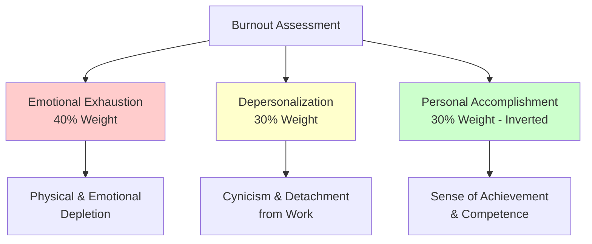
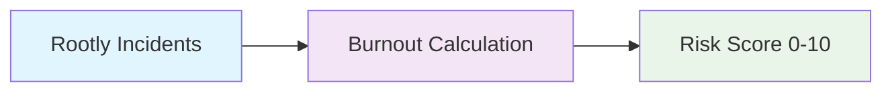
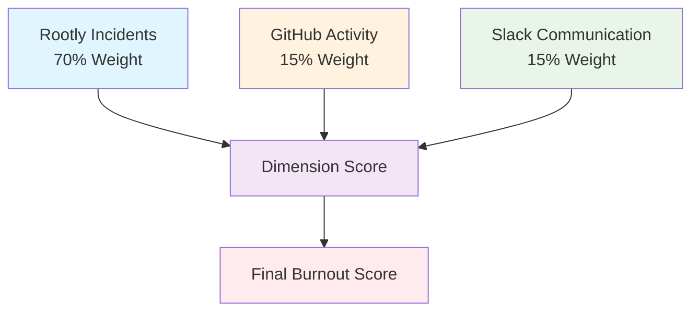
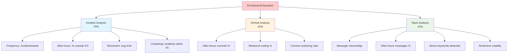
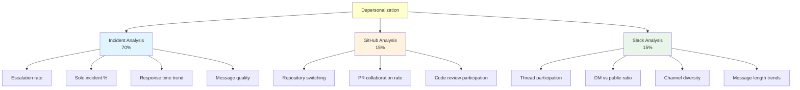
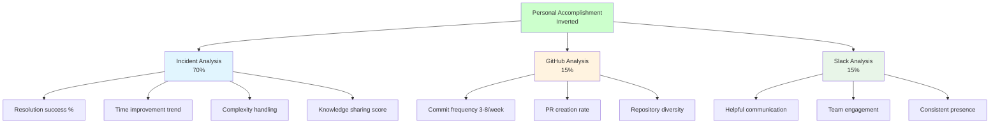
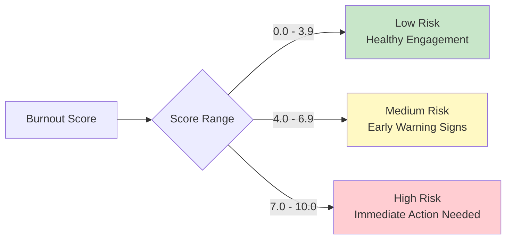
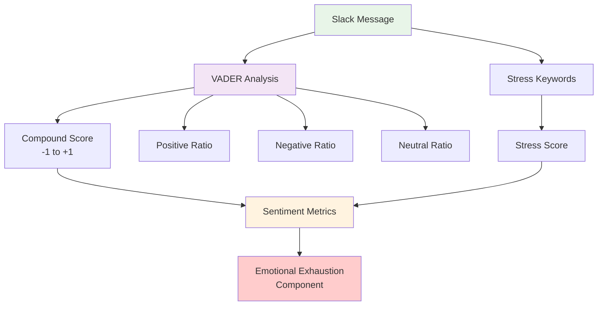
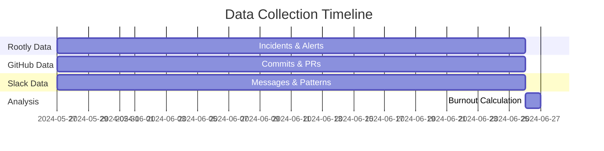
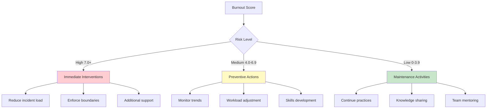

# Burnout Calculation Methodology

This document provides a detailed explanation of how the Rootly Burnout Detector calculates burnout scores using the Maslach Burnout Inventory framework, enhanced with modern engineering data sources.

## Overview

The system uses a **three-dimensional scoring approach** based on Christina Maslach's research, analyzing incident response patterns, coding activity, and communication behaviors to provide comprehensive burnout assessment.

## Maslach Burnout Inventory Framework

The Maslach Burnout Inventory identifies three key dimensions of occupational burnout:



## Data Sources & Integration

### Standard Analysis (Incident Data Only)


### Enhanced Analysis (Multi-Source)


## Detailed Dimension Calculations

### 1. Emotional Exhaustion (40% Weight)

Measures physical and emotional depletion from work demands.

#### Incident Data Components:
- **Incident Frequency Score**: Based on incidents per week vs. team baseline
- **After-Hours Work Score**: Percentage of incidents handled outside business hours
- **Resolution Time Score**: Average time to resolve incidents
- **Incident Clustering Score**: Multiple incidents within 4-hour windows

#### GitHub Data Components:
- **After-Hours Commits**: Commits outside 9-5 business hours
- **Weekend Coding**: Development work on weekends
- **Commit Clustering**: Rapid consecutive commits indicating stress

#### Slack Data Components:
- **Message Volume**: Daily message frequency
- **After-Hours Communication**: Messages sent outside business hours
- **Stress Indicators**: VADER sentiment analysis + stress keyword detection
- **Emotional Volatility**: Standard deviation of sentiment scores



#### Calculation Formula:
```
Incident Score = (frequency_score + after_hours_score + resolution_score + clustering_score) / 4
GitHub Score = (after_hours_commits + weekend_commits + clustering_ratio) / 3  
Slack Score = (volume_score + after_hours_msgs + stress_score + volatility_score) / 4

Emotional Exhaustion = (Incident Score × 0.7) + (GitHub Score × 0.15) + (Slack Score × 0.15)
```

### 2. Depersonalization (30% Weight)

Measures cynicism and detachment from work relationships.

#### Incident Data Components:
- **Escalation Rate**: Frequency of escalating incidents to others
- **Solo Work Rate**: Handling incidents without collaboration
- **Response Time Trends**: Increasing response times over time
- **Communication Quality**: Length and detail of resolution messages

#### GitHub Data Components:
- **Repository Switching**: Working across too many repositories
- **PR Collaboration**: Participation in pull request reviews
- **Code Review Quality**: Engagement in collaborative development

#### Slack Data Components:
- **Thread Participation**: Engagement in collaborative discussions
- **Private Message Ratio**: Avoiding public channels
- **Channel Diversity**: Context switching across too many channels
- **Communication Quality**: Message length and engagement depth



### 3. Personal Accomplishment (30% Weight - Inverted)

Measures sense of achievement and professional competence. **Note: Higher accomplishment scores are inverted to contribute to lower burnout.**

#### Incident Data Components:
- **Resolution Success Rate**: Percentage of incidents successfully resolved
- **Resolution Time Improvement**: Getting faster at resolving incidents over time
- **Complexity Handling**: Success with high-severity incidents
- **Knowledge Sharing**: Documentation and post-incident analysis quality

#### GitHub Data Components:
- **Productive Commit Frequency**: Optimal range of 3-8 commits per week
- **PR Creation Rate**: Contributing new features and improvements
- **Repository Contributions**: Consistent development across projects

#### Slack Data Components:
- **Communication Patterns**: Healthy, helpful communication style
- **Collaborative Engagement**: Active participation in team discussions
- **Consistent Presence**: Regular, professional communication



## Final Score Calculation

### Overall Burnout Score Formula

```
Final Burnout Score = 
    (Emotional Exhaustion × 0.4) + 
    (Depersonalization × 0.3) + 
    ((10 - Personal Accomplishment) × 0.3)
```

### Risk Level Classification



## Scoring Examples

### Example 1: Healthy Engineer
```
Emotional Exhaustion: 2.1 (low incident load, good boundaries)
Depersonalization: 1.8 (good collaboration, responsive)
Personal Accomplishment: 7.5 (successful resolutions, knowledge sharing)

Burnout Score = (2.1 × 0.4) + (1.8 × 0.3) + ((10 - 7.5) × 0.3)
             = 0.84 + 0.54 + 0.75
             = 2.13 (Low Risk)
```

### Example 2: At-Risk Engineer
```
Emotional Exhaustion: 6.2 (high incident load, after-hours work)
Depersonalization: 5.1 (increasing escalations, shorter messages)
Personal Accomplishment: 4.2 (declining resolution success)

Burnout Score = (6.2 × 0.4) + (5.1 × 0.3) + ((10 - 4.2) × 0.3)
             = 2.48 + 1.53 + 1.74
             = 5.75 (Medium Risk)
```

### Example 3: High-Risk Engineer
```
Emotional Exhaustion: 8.3 (excessive incident load, poor boundaries)
Depersonalization: 7.6 (high escalation rate, communication decline)
Personal Accomplishment: 2.8 (low resolution success, minimal sharing)

Burnout Score = (8.3 × 0.4) + (7.6 × 0.3) + ((10 - 2.8) × 0.3)
             = 3.32 + 2.28 + 2.16
             = 7.76 (High Risk)
```

## Sentiment Analysis Detail

### VADER Sentiment Scoring

The system uses VADER (Valence Aware Dictionary and sEntiment Reasoner) for Slack message analysis:



### Stress Keywords Detected:
- **High Stress**: "overwhelmed", "exhausted", "burned out", "drowning", "urgent"
- **Moderate Stress**: "busy", "behind", "pressure", "stretched", "tight timeline"
- **Negative Sentiment**: "sorry", "failed", "broken", "can't", "frustrated"

### Sentiment Volatility Calculation:
```
Volatility = Standard Deviation of Daily Sentiment Scores
- Low (0.0-0.2): Stable emotional state
- Moderate (0.2-0.4): Some emotional fluctuation  
- High (0.4+): High emotional instability
```

## Data Collection Periods

All analyses use consistent 30-day lookback periods:



## Validation & Calibration

The scoring system is calibrated based on:

1. **Clinical Research**: Maslach Burnout Inventory validated thresholds
2. **Engineering Context**: Adapted for on-call and development work patterns
3. **Team Baselines**: Scores relative to team and organizational norms
4. **Temporal Trends**: Changes over time more significant than absolute scores

## Recommendations Engine

Based on calculated scores, the system generates targeted recommendations:



This methodology provides a comprehensive, data-driven approach to identifying burnout risk before it becomes severe, enabling proactive intervention and support for engineering teams.